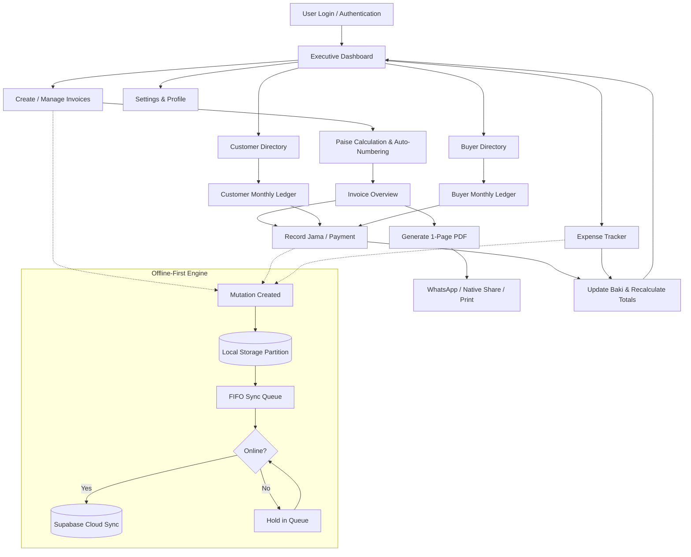

<div align="center">


# Shayona Invoice

### Retail & Wholesale Invoice & Ledger Management System

An offline-first, multi-tenant mobile invoice and financial ledger application built with **React Native (Expo SDK 57)** and **Supabase (PostgreSQL with Row Level Security)**. Designed for small retail and wholesale businesses to streamline billing, track Jama/Baki, record expenses, and generate professional printable invoices.

[](https://reactnative.dev/)
[](https://expo.dev/)
[](https://www.typescriptlang.org/)
[](https://supabase.com/)
[](#-offline-first-architecture)
[](LICENSE)

[Overview](#-project-overview) • [Key Features](#-key-features) • [Product Flow](#-product-flow) • [Architecture](#-offline-first-architecture) • [Database & Security](#-database-schema--security) • [Tech Stack](#-technology-stack) • [Getting Started](#-getting-started) • [Testing](#-testing--quality-assurance)

</div>

---

## 📖 Project Overview

### What is Shayona?

**Shayona Invoice** is a dedicated mobile invoicing, ledger management, and business accounting tool crafted for retail shops, wholesalers, local merchants, and independent traders. It replaces cumbersome physical _khata_ books and fragmented spreadsheets with a fast, reliable, bilingual digital workflow.

### Problems Solved

- **No Internet Dependency**: Full offline-first support. Invoices, customers, buyers, payments, and expenses can be recorded without active internet connectivity and synchronize automatically when online.
- **Credit & Payment Discrepancies**: Dedicated tracking for **Jama** (payments received/made) and **Baki** (outstanding dues) per bill and per account, preventing overpayments and loss of credit history.
- **Customer Privacy & Non-GST Compliance**: Produces crisp, 1-page printable invoices that highlight only item descriptions, rates, quantities, and Grand Total — strictly omitting internal accounting notes, payment history, Jama/Baki, and GST jargon.
- **Language Barriers**: Native instant toggle between **English** and **ગુજરાતી (Gujarati)** across every screen, dialog, ledger, and PDF invoice.

---

## ✨ Key Features

| Feature                             | Description                                                                                                                                                                                  |
| :---------------------------------- | :------------------------------------------------------------------------------------------------------------------------------------------------------------------------------------------- |
| **Authentication & Access**         | Multi-tenant auth with phone/password, session persistence via `expo-secure-store`, and complete PostgreSQL Row Level Security (RLS) data isolation.                                         |
| **Real-time Dashboard**             | Live financial metrics: Total Billed Sales, Jama Received, Baki Pending, Total Bills, and Net Profit/Balance with flexible time filtering (Today, This Week, This Month, This Year, Custom). |
| **Invoice Management**              | Multi-item invoice creation with automatic sequential numbering (`INV-0001`, `INV-0002`), itemized calculations, paise-accurate integer arithmetic, and draft/paid status.                   |
| **Customer Directory & Ledger**     | Comprehensive customer management with contact information, overall balance, full transaction history, and detailed **Monthly Ledger breakdown**.                                            |
| **Buyer Directory & Ledger**        | Dedicated supplier/buyer management for wholesale purchasing with transactional ledgers and outstanding balance tracking.                                                                    |
| **Jama (Payments) & Baki (Dues)**   | Granular payment recording against invoices with payment mode, timestamp, notes, remaining due calculation, and strict overpayment protection.                                               |
| **Business Expense Tracking**       | Categorized expense recording (Rent, Utilities, Salary, Inventory, Transport, Miscellaneous) integrated directly into dashboard financial summaries.                                         |
| **PDF Invoice Generation**          | Clean, professional 1-page PDF invoices generated on-device with custom shop branding, formatted dates, and bilingual Amount in Words (`expo-print`).                                        |
| **Native Sharing & WhatsApp**       | One-tap PDF invoice sharing via Android/iOS system share sheet and direct WhatsApp delivery (`Linking` & `expo-sharing`).                                                                    |
| **Direct Printing**                 | Direct wireless/network printing support for mobile thermal and standard A4 printers via native print spooler.                                                                               |
| **Business Profile & Shop Address** | Configurable business name, owner phone, and optional multi-line shop address rendered gracefully on invoices.                                                                               |
| **Bilingual Interface**             | Instant toggle between **English** and **ગુજરાતી (Gujarati)** with dynamic runtime switching and complete terminology translation.                                                           |
| **Theme Customization**             | Polished visual system supporting **Light**, **Dark**, and **System** themes with high-contrast accessibility and curated HSL color palettes.                                                |
| **Offline-First Synchronization**   | Partitioned local storage (`@shayona_user_{id}_{collection}`) with FIFO sync mutation queue, automatic NetInfo connectivity listeners, and conflict-safe cloud push/pull.                    |
| **Account Backup & Restore**        | Export and import structured Version 1 JSON backups with financial validation, data integrity checks, and ownership-safe merge algorithms.                                                   |
| **Over-The-Air (OTA) Updates**      | Built-in OTA update manager powered by `expo-updates` with manual check, progress indicators, channel detection, and reload triggers.                                                        |

---

## 🔄 Product Flow



---

## 🏗 Offline-First Architecture

Shayona uses a **local-first, cloud-backed architecture** designed to ensure zero downtime even in remote locations with poor connectivity:

```
┌────────────────────────────────────────────────────────┐
│                   React Native UI Layer                │
│         Expo Router • React Hook Form • Zod Schemas    │
└───────────────────────────┬────────────────────────────┘
                            │
┌───────────────────────────▼────────────────────────────┐
│              Application State & Cache Layer           │
│         TanStack React Query v5 • Zustand Stores       │
└───────────────────────────┬────────────────────────────┘
                            │
┌───────────────────────────▼────────────────────────────┐
│                 Local Persistence Layer                │
│  Partitioned AsyncStorage (@shayona_user_{id}_{table}) │
│        In-Memory Fast Read Cache • SecureStore         │
└───────────────────────────┬────────────────────────────┘
                            │
              (Network Service & Connectivity)
                            │
┌───────────────────────────▼────────────────────────────┐
│               Synchronization & Queue Worker           │
│     FIFO Outbound Mutation Queue • Dependency Order    │
└───────────────────────────┬────────────────────────────┘
                            │ HTTPS / REST (Public Anon Key)
┌───────────────────────────▼────────────────────────────┐
│                 Supabase Cloud Database                │
│       PostgreSQL with Row Level Security (RLS)         │
└────────────────────────────────────────────────────────┘
```

### Key Architectural Invariants

1. **User Partitioning**: Local keys are isolated per user (`@shayona_user_<USER_ID>_<COLLECTION>`) preventing cross-account data leaks on shared devices.
2. **Deterministic Financial Math**: All currency values are stored as integers in **paise** (1 INR = 100 paise) to eliminate floating-point rounding errors.
3. **Strict Balance Calculation**: $\text{Remaining (Baki)} = \max(0, \text{Total Amount} - \text{Paid Amount (Jama)})$.
4. **Non-GST Presentation**: Customer-facing PDF documents strictly exclude internal ledger entries, Jama, Baki, and tax line items.

---

## 🗄 Database Schema & Security

The backend is powered by **Supabase PostgreSQL** utilizing strict multi-tenant Row Level Security policies where every row is verified against `auth.uid() = user_id`.

```
                    ┌──────────────────────────┐
                    │         profiles         │
                    │──────────────────────────│
                    │ id (PK, UUID -> auth)    │
                    │ shop_name (TEXT)         │
                    │ phone (TEXT)             │
                    │ address (TEXT)           │
                    │ created_at / updated_at  │
                    └────────────┬─────────────┘
                                 │ 1:N
         ┌───────────────────────┼───────────────────────┐
         │ 1:N                   │ 1:N                   │ 1:N
┌────────▼─────────┐    ┌────────▼─────────┐    ┌────────▼─────────┐
│    customers     │    │      buyers      │    │     expenses     │
│──────────────────│    │──────────────────│    │──────────────────│
│ id (PK, UUID)    │    │ id (PK, UUID)    │    │ id (PK, UUID)    │
│ user_id (FK)     │    │ user_id (FK)     │    │ user_id (FK)     │
│ name (TEXT)      │    │ name (TEXT)      │    │ category (TEXT)  │
│ phone (TEXT)     │    │ phone (TEXT)     │    │ amount (BIGINT)  │
│ address (TEXT)   │    │ address (TEXT)   │    │ expense_date     │
└────────┬─────────┘    └────────┬─────────┘    └──────────────────┘
         │ 1:N                   │ 1:N
         └───────────┬───────────┘
                     │
            ┌────────▼─────────┐
            │     invoices     │
            │──────────────────│
            │ id (PK, UUID)    │
            │ user_id (FK)     │
            │ invoice_number   │
            │ party_type       │
            │ customer_id (FK) │
            │ buyer_id (FK)    │
            │ total_amount     │
            │ paid_amount      │
            │ status           │
            └────────┬─────────┘
                     │
         ┌───────────┴───────────┐
         │ 1:N                   │ 1:N
┌────────▼─────────┐    ┌────────▼─────────┐
│  invoice_items   │    │ payment_history  │
│──────────────────│    │──────────────────│
│ id (PK, UUID)    │    │ id (PK, UUID)    │
│ user_id (FK)     │    │ user_id (FK)     │
│ invoice_id (FK)  │    │ invoice_id (FK)  │
│ description      │    │ amount (BIGINT)  │
│ quantity (NUM)   │    │ payment_date     │
│ rate (BIGINT)    │    │ payment_mode     │
│ amount (BIGINT)  │    │ notes (TEXT)     │
└──────────────────┘    └──────────────────┘
```

### Database Migrations

Database migrations are located in `supabase/migrations/` and structured for seamless deployment:

- `001_initial_schema.sql`: Core tables (`profiles`, `customers`, `buyers`, `invoices`, `invoice_items`), triggers, and RLS.
- `002_storage_setup.sql`: Storage bucket configuration and security policies.
- `003_performance_indexes.sql`: B-tree performance indexes on user IDs, dates, and foreign keys for sub-millisecond lookups.
- `004_security_hardening.sql`: Multi-tenant authorization hardening and automated profile initialization triggers.
- `005_payment_history.sql`: Granular payment audit trail schema and RLS policies.
- `006_expenses.sql`: Business expense tracking schema with category indexes.
- `007_profile_address.sql`: Multi-line shop address support for profile and invoice headers.

---

## 💻 Technology Stack

| Category                 | Technology                                                                                                 |
| :----------------------- | :--------------------------------------------------------------------------------------------------------- |
| **Core Framework**       | [React Native 0.86.3](https://reactnative.dev/) with [React 19.2.3](https://react.dev/)                    |
| **Tooling & Platform**   | [Expo SDK 57](https://docs.expo.dev/) (`expo`, `expo-router`, `expo-updates`, `expo-print`)                |
| **Programming Language** | [TypeScript 6.0](https://www.typescriptlang.org/) with strict type checking                                |
| **Navigation & Routing** | [Expo Router v57](https://docs.expo.dev/router/introduction/) (File-based navigation with typed routes)    |
| **State & Data Caching** | [TanStack React Query v5](https://tanstack.com/query/v5) + [Zustand v5](https://github.com/pmndrs/zustand) |
| **Local Persistence**    | `@react-native-async-storage/async-storage` + `expo-secure-store`                                          |
| **Forms & Validation**   | [React Hook Form](https://react-hook-form.com/) + [Zod](https://zod.dev/)                                  |
| **Backend & Database**   | [Supabase](https://supabase.com/) (PostgreSQL with RLS & REST API)                                         |
| **Documents & Sharing**  | `expo-print`, `expo-sharing`, `expo-file-system`                                                           |
| **Network & Telemetry**  | `@react-native-community/netinfo`                                                                          |

---

## 📂 Project Structure

```
shayona2/
├── app/                          # Expo Router file-based application routes
│   ├── (auth)/                   # Authentication route group (login, signup, forgot-password)
│   ├── (app)/                    # Authenticated route group
│   │   ├── (tabs)/               # Bottom tab navigation (Dashboard, Invoices, Customers, Buyers)
│   │   ├── invoices/             # Invoice creation & detail views
│   │   ├── customers/            # Customer detail & ledger views
│   │   ├── buyers/               # Buyer detail & ledger views
│   │   ├── expenses.tsx          # Expense tracking screen
│   │   ├── business-profile.tsx  # Shop & business profile settings
│   │   ├── app-updates.tsx       # OTA update manager screen
│   │   └── settings.tsx          # Language, theme, backup & account settings
│   ├── _layout.tsx               # Root layout with theme & auth providers
│   └── +not-found.tsx            # 404 handler
├── assets/                       # Static fonts, icons, and official Shayona logos
│   └── images/                   # App icons, splash screens, and horizontal/stacked logos
├── src/                          # Application source code
│   ├── components/               # Reusable UI components (AppModal, Button, Input, Card, Header)
│   ├── database/                 # Local partitioned storage & sync queue manager (`localStore.ts`)
│   ├── features/                 # Domain feature modules (auth, invoices, customers, buyers, expenses)
│   ├── localization/             # Bilingual i18n engine & translations (English & Gujarati)
│   ├── services/                 # API & system services (Supabase, PDF, Sync, Backup, Updates)
│   ├── store/                    # Global Zustand stores (AuthStore, ThemeStore, UpdateStore)
│   ├── theme/                    # Design system (colors, typography, spacing, shadows, styles)
│   ├── types/                    # TypeScript interfaces & database definitions
│   └── utils/                    # Math, phone formatters, and Number-to-Words generators
├── supabase/                     # Supabase database configuration & migrations
│   └── migrations/               # Sequential SQL migration files (001 - 007)
├── eas.json                      # Expo Application Services (EAS) build profiles
├── app.json                      # Expo application manifest & configuration
└── package.json                  # Dependencies and scripts
```

---

## 🚀 Getting Started

### 1. Prerequisites

- **Node.js**: v18.x or later
- **npm** or **yarn**
- **Expo Go** app on a physical Android/iOS device, or Android Studio / Xcode simulator

### 2. Clone and Install

```bash
# Clone the repository
git clone https://github.com/krisvasoya/shayona2.git
cd shayona2

# Install dependencies
npm install
```

### 3. Environment Variables

Create a `.env` file in the root directory (refer to `.env.example`):

```env
EXPO_PUBLIC_SUPABASE_URL=https://your-project-ref.supabase.co
EXPO_PUBLIC_SUPABASE_ANON_KEY=your-anon-public-key
```

> 🔒 **Security Notice**: Never embed Supabase `service_role` keys into the mobile client. The application strictly uses the public `anon` key; all security is enforced server-side via PostgreSQL Row Level Security.

### 4. Database Setup

Apply the SQL migrations located in `supabase/migrations/` sequentially via the Supabase Dashboard SQL Editor or Supabase CLI:

```bash
# Apply migrations sequentially
001_initial_schema.sql
002_storage_setup.sql
003_performance_indexes.sql
004_security_hardening.sql
005_payment_history.sql
006_expenses.sql
007_profile_address.sql
```

### 5. Running the Application

```bash
# Start standard Expo development server
npm start

# Run directly on Android device / emulator
npm run android

# Run directly on iOS simulator (macOS required)
npm run ios

# Start with ngrok tunnel for remote physical device testing
npx expo start --tunnel
```

---

## 🧪 Testing & Quality Assurance

The codebase includes an automated test suite with **23 comprehensive test suites** validating domain logic, multi-user isolation, mathematical accuracy, offline sync queues, and edge cases:

```bash
# Run full Jest test suite
npm test

# Run TypeScript typecheck without emitting output
npm run typecheck

# Lint codebase for ESLint compliance
npm run lint

# Validate Prettier code formatting
npm run format:check
```

---

## 📦 Production Builds (EAS)

The project includes pre-configured build profiles in `eas.json` for creating standalone Android APKs and Google Play App Bundles:

```bash
# 1. Install Expo Application Services CLI
npm install -g eas-cli

# 2. Authenticate with Expo account
eas login

# 3. Build Preview APK (direct installable APK for device testing)
eas build --platform android --profile preview

# 4. Build Production Android App Bundle (.aab for Google Play Store)
eas build --platform android --profile production
```

---

## 🔒 Security & Privacy Guarantees

- **Multi-Tenant Isolation**: Enforced at the PostgreSQL level via `USING (auth.uid() = user_id)`. Users can never access or mutate another merchant's records.
- **Client Zero-Trust**: All database queries are authenticated via JWT bearer tokens; no privileged administrative keys exist in the client bundle.
- **Secure Credential Storage**: Authentication sessions and refresh tokens are stored using hardware-backed encryption via `expo-secure-store`.
- **Customer Document Privacy**: Generated customer-facing PDFs contain zero internal payment notes, Jama records, or outstanding debts.

---

## 📄 License

This project is licensed under the [MIT License](LICENSE).
